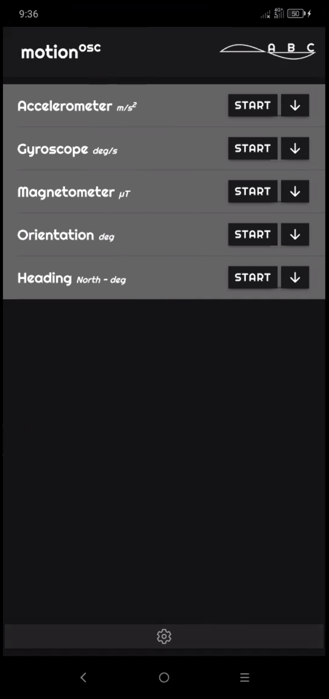
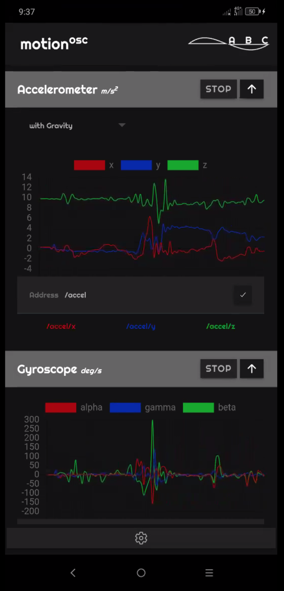
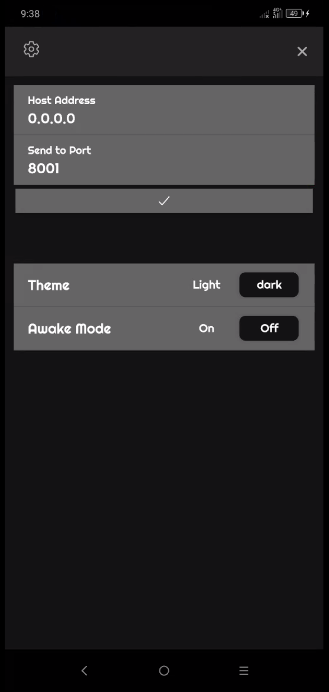

# abc-motionOSC
Ionic mobile application for sending smartphone motion sensors values via OSC 

## sensors
- accelerometer (_with or without gravity_)
- gyroscope
- magnetometer
- orientation
- heading (_true and magnetic_)

## **APPLICATION**
[abc-motionOSC](https://github.com/alessandrofiordelmondo/abc-motionOSC/tree/master/app) 
The application is only for Android. It was tested in _Lenovo K10 note_ model:`L38111` 
 
**Technical Details** 
- `CPU`: Octa-core 2.20 GHz
- `RAM`: 6 GB
- `Android version`: 9 
 

